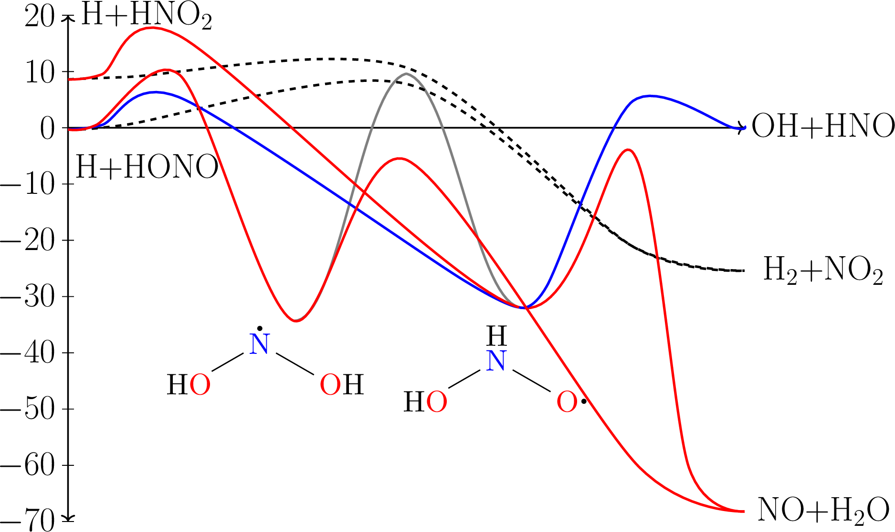

# Introduction

## What is <span class="smallcaps">MESS</span>?

  - <span class="smallcaps">MESS</span> is the **M**aster **E**quation
    **S**ystem **S**olver
    ([Publication](https://doi.org/10.1021/jp4060704)), a component of
    the <span class="smallcaps">PAPR</span> suite of chemical kinetics
    codes
    
      - Developers: Y. Georgievskii, C. F. Goldsmith, J. A. Miller, M.
        P. Burke, and S. J. Klippenstein
    
      - <span class="smallcaps">PAPR</span>:
        <https://tcg.cse.anl.gov/papr/codes/mess.html>

  - Conformers on a potential energy surface are connected via
    transition states

  - Ab initio calculations provide necessary input information to
    calculate partition functions and determine rates via transition
    state theory (TST)

##  Potential Energy Surface

Consider simple PES as example system
([Publication](https://doi.org/10.1016/j.proci.2018.06.208))

  - System consists of three kinds of nodes (conformers):
    
      - <span class="smallcaps">Bimolecular</span>: a pair of fragments
        which are lumped together, *e.g.* +
    
      - <span class="smallcaps">Well</span>: a unimolecular
        intermediate, *e.g.*
    
      - <span class="smallcaps">Barrier</span>: a transition state (TS)
        between two wells/bimoleculars

  - Each conformer is described by its geometry and frequencies and
    (relative) energy



# MESS Input File

## Input file overview

  - Global section (unnamed header) specifies parameters for solution of
    the master equation

  - Specify temperatures, pressures, calculation parameters

  - Two major choices for calculation method
    
      - <span class="smallcaps">direct</span>: fuller, more expensive
        calculations (not so good at low temperature)
    
      - <span class="smallcaps">low-eigenvalue</span>: assume which
        eigenvalues are chemical and which are relaxational, numerically
        cheap, not accurate at high temperatures

  - <span class="smallcaps">Model</span> definition follows and begins
    with collision parameters

  - All conformers are then described to define system

### Header Information

    TemperatureList[K]              400.0 450.0 500.0 550.0 600.0 650.0 700.0 750.0 800.0 850.0 900.0 950.0 1000.0 1050.0 1100.0 1150.0 1200.0 1250.0 1300.0 1350.0 1400.0 1450.0 1500.0 1550.0 1600.0 1650.0 1700.0 1750.0 1800.0 1850.0 1900.0 1950.0 2000.0 2050.0 2100.0 2150.0 2200.0 2250.0 2300.0 2350.0 2400.0 2450.0 2500.0
    PressureList[atm]			0.01 0.1 0.316 1.0 3.16 10.0 31.6 100.0 
    EnergyStepOverTemperature		.2
    ExcessEnergyOverTemperature		30
    ModelEnergyLimit[kcal/mol]		400
    CalculationMethod			direct #low-eigenvalue #direct
      WellCutoff				10
      ChemicalEigenvalueMax			0.2 
      GlobalCutoff[kcal/mol]			-45.0
    Model
      EnergyRelaxation
        Exponential
          Factor[1/cm]			200
          Power				.85
          ExponentCutoff			15
        End
      CollisionFrequency
        LennardJones
          Epsilons[1/cm]			6.95  285.2 
          Sigmas[angstrom]			2.55  5.182
          Masses[amu]			4.0 59
        End

### Bimolecular Input

    !-----------------------------------------------
    !Bimolecular R1:  Reactants H + HNO2
    !-----------------------------------------------
    
      Bimolecular		hno2	# H+HNO2
        Fragment	H
          ! Current data taken from:
          !/gpfs/data/cfgoldsm/cfgoldsm/qchem/gas_phase/h/h/dft/h_b2plypd3_ccpvtz.log
          Atom
            Mass[amu]    1
            ElectronicLevels[1/cm]          1
                    0       2
          End            
        Fragment	HNO2
          ! Current data taken from:
          !/gpfs/data/cfgoldsm/mfuller/qchem/noh/n1o2/h1n1o2/hno2/hno2_b2plypd3_ccpvtz.log
          RRHO
            Geometry[angstrom]	4
    	N	  0.000000	  0.000000	  0.000000
    	O	  0.000000	  0.000000	  1.219352
    	O	  0.955111	  0.000000	 -0.758013
    	H	 -0.933369	  0.000000	 -0.450837
    
            Core	RigidRotor
              SymmetryFactor	2
            End
    
            Frequencies[1/cm]	6
    	 784.8	1047.3	1365.3
    	1513.7	1643.6	3225.1
    
            ZeroEnergy[kcal/mol]	0.0
            ElectronicLevels[1/cm]	1
                0	1
          End           
        GroundEnergy[kcal/mol]			8.56
      End

### Well Input

``` 
!-----------------------------------------------
!Well 2: honho
!-----------------------------------------------
  Well     honho	# HONHO
   Species
      ! Current data taken from:
      !/gpfs/data/cfgoldsm/mfuller/qchem/noh/n1o2/h2n1o2/honho/honho_b2plypd3_ccpvtz.log
      RRHO
        Geometry[angstrom]	5
	N	  0.000000	  0.000000	  0.000000
	O	  0.000000	  0.000000	  1.242823
	O	  1.246970	  0.000000	 -0.684257
	H	 -0.604321	  0.645919	 -0.510082
	H	  1.844105	 -0.334291	  0.001465

        Core	RigidRotor
          SymmetryFactor	1
        End
        Rotor     Hindered
          Group                  5 		# atoms in rotating group excluding the atom on the axis
          Axis                   1 3 		# rotational axis
          Symmetry               1 		# 360/angle of rotation to recover the initial structure
          Potential[kcal/mol]    36 		# number of equidistant point on the potetial energy curve with respect to the rotational angle
 0.00  0.01  0.08  0.20  0.34  0.49  0.65  0.84  1.06  1.33  1.65  2.03  2.48  2.98  3.54  4.16  4.79  5.41  5.93  6.27  6.36  6.16  5.69  5.05  4.34  3.63  3.00  2.44  1.98  1.58  1.24  0.94  0.66  0.41  0.20  0.06
          End

        Frequencies[1/cm]	8
	 544.7	 785.8
	 956.3	1298.7	1415.2
	1519.8	3406.8	3749.3

        !Torsional frequencies:	 279.4

        ZeroEnergy[kcal/mol]	-31.94
        ElectronicLevels[1/cm]	1
            0	2
      End   
```

### Barrier Input

``` 

!-----------------------------------------------
!TS abstraction: h+hno2 <--> honho
!-----------------------------------------------

  Barrier	B4	hno2	honho	# 

      ! Current data taken from:
      !/gpfs/data/cfgoldsm/mfuller/qchem/noh/n1o2/h2n1o2/ts/ts_h_hno2_to_honho/ts_h_hno2_to_honho_b2plypd3_ccpvtz.log
      RRHO
        Geometry[angstrom]	5
	N	  0.000000	  0.000000	  0.000000
	O	  0.000000	  0.000000	  1.211134
	O	  0.972148	  0.000000	 -0.753057
	H	 -0.921040	  0.065743	 -0.468641
	H	  1.786284	  1.415784	 -0.743167

        Core	RigidRotor
          SymmetryFactor	1
        End

        Frequencies[1/cm]	8
	 220.2	 518.6	 793.0
	1038.6	1355.2	1501.6
	1619.2	3235.5
        !Imaginary mode:  -1352.8

        ZeroEnergy[kcal/mol]	16.16
        ElectronicLevels[1/cm]	1
            0	2
        Tunneling	Eckart
          ImaginaryFrequency[1/cm]  1352.8
          WellDepth[kcal/mol]	7.60
          WellDepth[kcal/mol]	48.10
        End
      End
```

## Generating <span class="smallcaps">MESS</span> Input Blocks

  - While you could, it is tedious and error-prone to write input files
    manually

  - The utility program <span class="smallcaps">writemess</span> reads a
    <span class="smallcaps">Gaussian</span> output (log) file and writes
    a conformer template

  - Optionally, hindered rotors (<span class="smallcaps">Gaussian</span>
    log files) and energy from a single-point calculation
    (<span class="smallcaps">ORCA</span>, currently) may also be added
    and written concurrently

# Getting Results

## Job Submission and Output

  - Assuming everything is installed correctly, job submission on the
    HPC with slurm is simple: we call
    <span class="smallcaps">mess</span> on the input file
    
      - If we have an input file for a network of bimoleculars, wells,
        and barriers, then we call <span class="smallcaps">mess</span>
        on the input file
    
      - For two bimoleculars connected by a single transition state, we
        call <span class="smallcaps">abstraction</span> on the input
        file

  - A log file and output file will be generated by
    <span class="smallcaps">MESS</span>

  - Output file can be split into three sections:
    
    1.  System network at the top
    
    2.  Rate tables at each temperature and pressure condition
    
    3.  Rate tables for each species pair

  - The output file requires conversion to a recognized format for
    inclusion in chemical kinetic mechanisms

## Fitting the Output

  - A function to fit the output data to pressure-dependent, modified
    Arrhenius expressions is posted on the
    <span class="smallcaps">MESS</span> webpage,
    <http://tcg.cse.anl.gov/papr/codes/mess/mess_aux/mod_arr.tgz>

  - You will likely need to make some small changes for your specific
    system, but this will output
    <span class="smallcaps">CHEMKIN</span>-format
    <span class="smallcaps">PLOG</span> fits for all of the conformer
    pairs

# Additional Resources

  - The <span class="smallcaps">MESS</span> manual:
    <http://tcg.cse.anl.gov/papr/codes/mess/messmanual_3_23_16.pdf>

  - More examples to run and test:
    <http://tcg.cse.anl.gov/papr/codes/mess/MESS_Examples.tgz>
